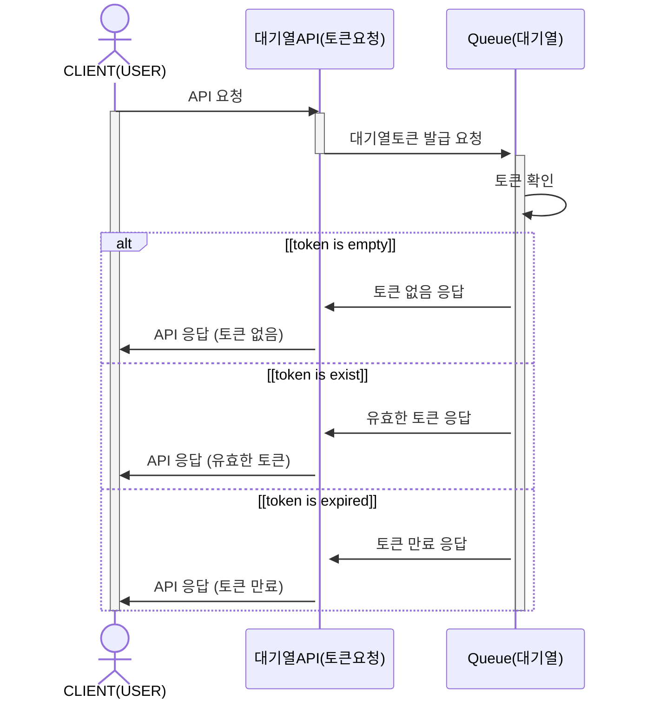

## 접기 시작

시퀀스 다이어그램

<h3>유저 대기열 토큰 발급 API</h3>

```mermaid
sequenceDiagram
  actor CLIENT as CLIENT(USER)
  participant API as 대기열API(토큰요청)
  participant Queue as Queue(대기열)

  CLIENT ->> API: API 요청
  activate CLIENT
  activate API
  API ->>+ Queue: 대기열토큰 발급 요청
  deactivate API
  activate Queue
  Queue ->> Queue: 토큰 확인
  alt [token is empty]
    Queue ->>+ API: 토큰 없음 응답
    API ->> CLIENT: API 응답 (토큰 없음)
  else [token is exist]
    Queue ->>+ API: 유효한 토큰 응답
    API ->> CLIENT: API 응답 (유효한 토큰)
  else [token is expired]
    Queue ->>+ API: 토큰 만료 응답
    API ->> CLIENT: API 응답 (토큰 만료)
  end
  deactivate Queue
  deactivate CLIENT
```

 
